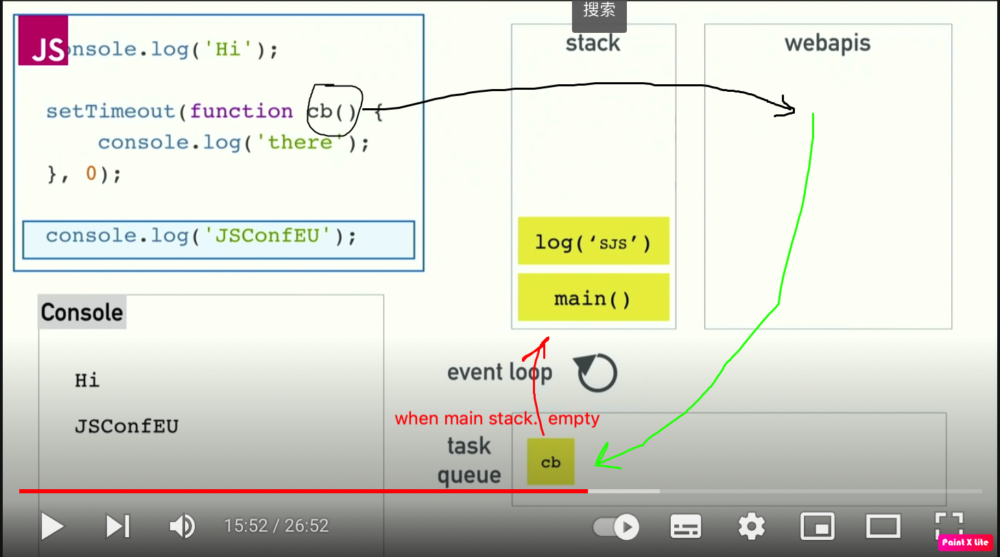
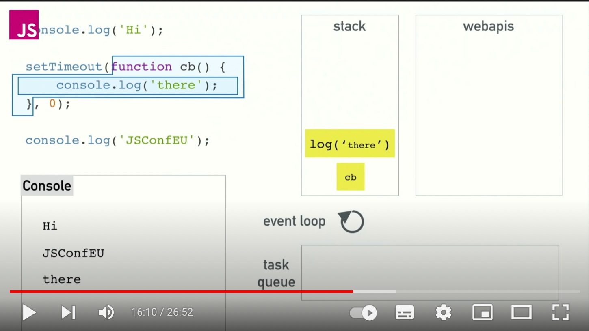

# Event Loop

## [菲利普·罗伯茨：到底什么是Event Loop呢？ | 欧洲 JSConf 2014](https://youtu.be/8aGhZQkoFbQ)

### [Loupe](http://latentflip.com/loupe/)

Loupe is a little visualization to help you understand how JavaScript's call stack/event loop/callback queue interact with each other.

## Node.js Event Loop

from [link](https://twitter.com/RichOnTheWeb/status/494959181871316992)

##

+ “从前面实现异步I/O的过程描述中，我们可以提取出异步I/O的几个关键词：单线程、事件循环、观察者和I/O线程池。这里单线程与I/O线程池之间看起来有些悖论的样子。由于我们知道JavaScript是单线程的，所以按常识很容易理解为它不能充分利用多核CPU。事实上，在Node中，除了JavaScript是单线程外，Node自身其实是多线程的，只是I/O线程使用的CPU较少。另一个需要重视的观点则是，除了用户代码无法并行执行外，所有的I/O（磁盘I/O和网络I/O等）则是可以并行起来的。” (深入浅出Node.js)
